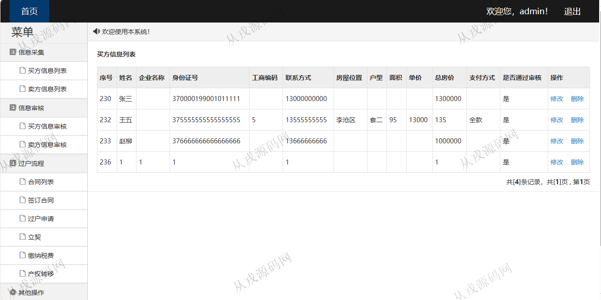
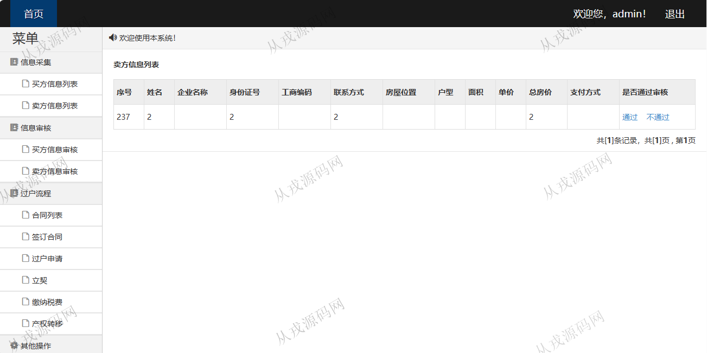
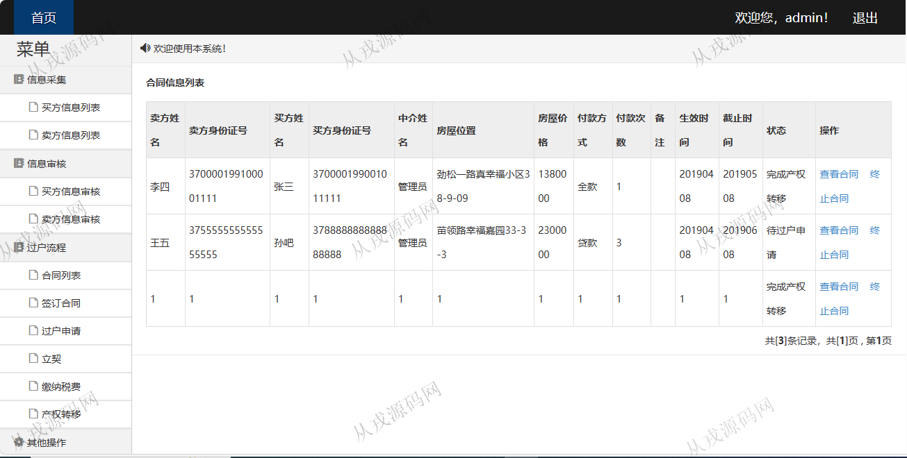
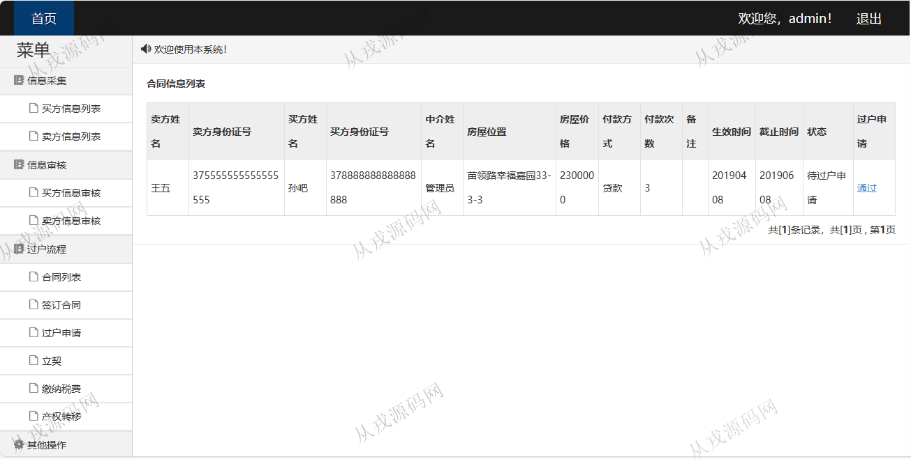
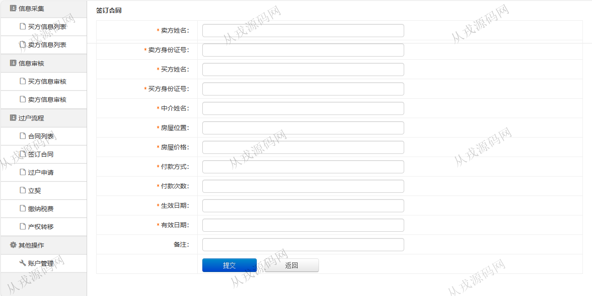
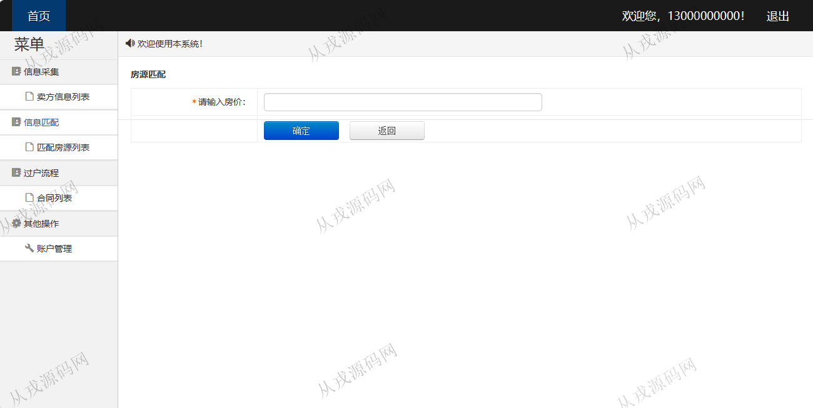
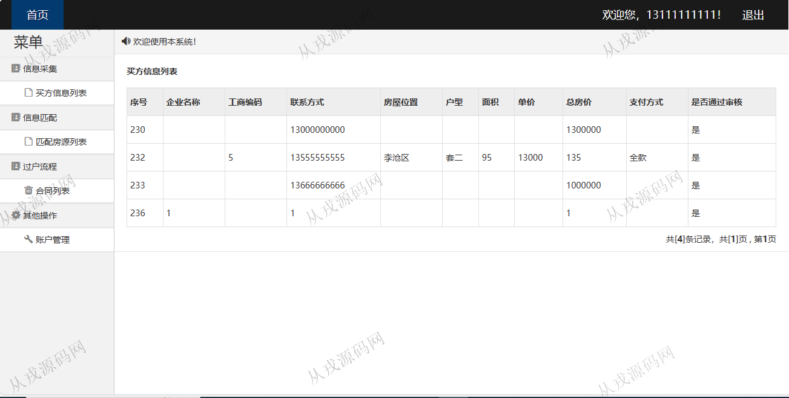
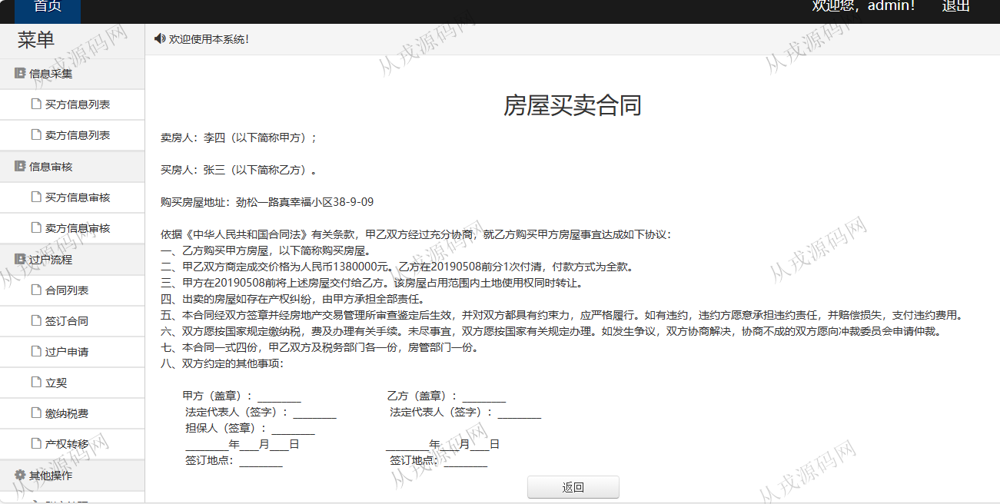

<h1 align="center">175.二手房买卖信息管理系统</h1>

- <b>完整代码获取地址：从戎源码网 ([https://armycodes.com/](https://armycodes.com/))</b>
- <b>技术探讨、资料分享，请加QQ群：692619798</b> 
- <b>作者微信：19941326836  QQ：952045282</b> 
- <b>承接计算机毕业设计、Java毕业设计、Python毕业设计、深度学习、机器学习</b>
- <b>选题+开题报告+任务书+程序定制+安装调试+论文+答辩ppt 一条龙服务</b>
- <b>所有选题地址 ([https://github.com/YuLin-Coder/AllProjectCatalog](https://github.com/YuLin-Coder/AllProjectCatalog)) </b>

## 项目介绍
基于ssm的二手房买卖信息管理系统：前端 jsp、jquery、bootstrap，后端 springmvc、spring、mybatis；角色分为管理员、买方、卖方；集成信息审核、过户流程等功能于一体的系统。

## 功能介绍

- 买方信息：买方信息列表查询，修改，删除
- 卖方信息：卖方信息列表查询，修改，删除
- 买方信息审核：买方信息列表查询，是否通过审核
- 卖方信息审核：卖方信息列表查询，是否通过审核
- 合同列表：合同列表查询，查看合同详情，终止合同，合同签订
- 过户申请：过户信息列表查询，过会申请审核，立契查询，缴纳税费查询，产权转移查询
- 账号管理：账户信息列表查询，密码修改

## 环境

- <b>IntelliJ IDEA 2021.3</b>

- <b>Mysql 5.7.26</b>

- <b>Tomcat 7.0.73</b>

- <b>JDK 1.8</b>

## 运行截图

